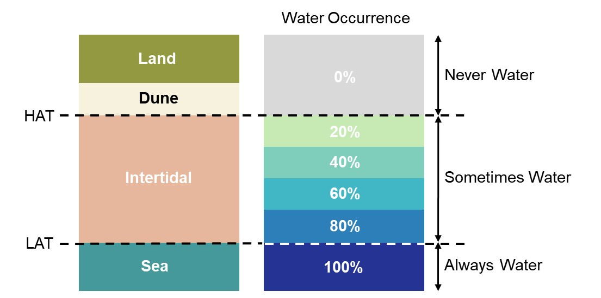

# 1.0 Coast X-Ray
 
The intertidal zone is a dynamic environment, which results in the relativly frequent change of high and line water marks. It is important to be able to monitor these changes, as intertidal stability or instability can have a considerable influence on the rate and extent of coastal erosion and flooding, which are both expected to worsen with climate change. 

Bespoke tidal surveys to capture the full extent of the intertidal is often expensive and logistically difficult, especially in areas with large tidal ranges. However, an approach developed within the Scottish [Dynamic Coast](www.DynamicCoast.com) project using Sentinel 2 data offers insight into the extent of the intertidal zone.

Sentinel 2 images are collected for an area of interest to create a time series of images, with each image capturing a slighlty different tidal position. 

<p align="center">

</p>

We can then identify the water in each each image (using the Normalised Difference Water Index (NDWI)) and create an image that represents the fequency of water occurrence across the intertidal. This can be used to make interpretations about the intertidal geomorphology, as shown in the image below:

<p align="center">

</p>

Therefore, areas that are always water (i.e. areas below Low Water) will always be covered by water and have a water occurrence frequency of 100% (i.e. in all of the images in the image collection, water was always identified in that location). Areas that are sometimes covered by water represent the intertidal zone. An example of the Coast X-Ray output for St. Andrews, Fife, Scotland,  is shown below:

<p align="center">

</p>

A fully interactive map based version can be see [here](https://jamesmfitton.users.earthengine.app/view/coastxray)

## 1.1 The Code 

Coast X-Ray utilises [Google Earth Engine](https://earthengine.google.com/) (GEE) to produce the outputs. This is a very powerful tool and if you are a new user of GEE, it is highly recommended that you take a look at the [introduction material](https://developers.google.com/earth-engine/) and to become familiar with the [GEE code editor](https://code.earthengine.google.com/) and GEE terminology before proceeding with the Coast X-Ray code.

GEE uses Javascript within the online code editor, however added functionality (mainly associated with the exporting of assets) can be achieved by using Python via the [Python API](https://developers.google.com/earth-engine/python_install). Therefore, Coast X-Ray uses Python, however, the terminology assocaited with GEE remains the same. There is also some code which runs within [R](https://www.r-project.org/).   

## 1.2 The Code Explained

It can be sometimes difficult, especially for new users, to understand what the code does and for what purpose. Below is a succint explanation of the processes that are carried out by the code. Note, that for the code to function correctly these steps need to be performed in sequence.

**Step 1. Generate a grid (globalGrid.ipynb)**

In order to make processing within GEE more efficient areas of interest are broken up into small areas using a grid. Coast X-Ray uses a Discrete Global Grid (DDG) to split the globe into small areas. Coast X-Ray makes use of the ISEA3H: Icosahedral Snyder Equal Area Aperture 3 Hexagonal Grid which can be accessed via the R package dggridR. A hexagonal grid was chosen as this ensures that (almost) all cells are of an equal area, regardless where you are on the globe. The ISEA3H grid can be created at different resolutions (i.e. cell sizes), with an example of given below of the 5th resolution:

<p align="center">

</p>

The code within *globalGrid/notebooks/globalGrid.ipynb* generates a global grid of hexagons, at the users desired resolution, which is then saved locally. 

**Step 2 - Generate an intertidal grid (intertidalGrid.ipynb)**

The global grid created in Step 1 is large and needs to be filtered down to an area of interest. However, the code within *intertidalGrid/notebooks/intertidalGrid.ipynb* not only filters the grid cells to the area of interest, but also to the cells that contain intertidal areas. This means that a whole country can be used as an area of interest, however only the intertidal/coastal cells will be selected for use in the subsequent analysis. 

To identify the intertidal/coastal cells three supporting datasets are used: data on the intertidal area [Murray et al. 2019](https://www.nature.com/articles/s41586-018-0805-8?WT.feed_name=subjects_biological-sciences), bathymetry data [GEBCO](https://www.gebco.net/), and the [OpenStreetMap](https://wiki.openstreetmap.org/wiki/Coastline) coastline.

**Step 3 - Generate water occurrence analysis (waterOccurrence)**

The intertidal grid that was generated in the Step 2 will now be used to produce a water occurrence analysis. Each of the cells within the intertidal grid are processed in turn by the script in *waterOccurrence/notebooks/waterOccurrence.ipynb*, producing a seperate image for each cell. The images are added to GEE within an image collection, which can support filterting of the images, and mosaicing.

For each cell within the intertidal grid, the water occurrence image is produced by:
- clipping the Sentinel 2 image collection to the grid cell
- filtering out images that do not cover all of the grid cell area (due to cloud cover or being at the edge of an image)
- calculating the Normalised Difference Water Index (NDWI) for each image
- identifying the water in each image using a fixed threshold approach
- amalgamting the time series of images to produce a single image by calculating the water occurrence percentage
- exporting the image to an image collection on GEE
- exporting image metadata to a feature dataset


## 3.0 Installation

To use the code within Coast X-Ray the simplest approach is to create an environment in which to run the code. The environment mimics the Python environment that the code was developed upon, therefore allowing the code to run without errors. This environment is created and managed using [Anaconda](https://www.anaconda.com). The following instructions will guide you through the steps to install Anaconda and use Coast X-Ray.

GEE also offer a [guide](https://developers.google.com/earth-engine/python_install-conda) on installing GEE in an Anaconda environment and information on the GEE [Python API](https://developers.google.com/earth-engine/python_install).

**Step 1: Download Coast X-Ray:** Clone or download the Coast X-Ray repository from GitHub using the button 'Clone or Download' above and save it somewhere locally on your computer, e.g. C:\CoastXRay.

**Step 2. Anaconda:** Install [Anaconda](https://www.anaconda.com/download/). Open the Anaconda prompt (PC) or on a Mac or Linux system open a terminal window. Use the `cd` command to change the directory, and navigte to go the folder where you have downloaded the Coast X-Ray repository (see [here](https://www.digitalcitizen.life/command-prompt-how-use-basic-commands) for information on how to use the command prompt).

**Step 3: Create a new environment:** Create a new environment named `coastxray` with all the required packages:

```
conda env create -f environment.yml -n coastxray
```

This environment should ensure that all the required packages are installed. This environment is called `coastxray`. The next step is to active the environment in the command prompt with:

```
conda activate coastxray
```

The terminal command line prompt should now have changed from (base) to (coastxray).

### 3.2 Activate Google Earth Engine Python API

To use GEE you need to create an account. Go to https://earthengine.google.com and sign up. Once you have an account, in the Anaconda prompt run:

```
earthengine authenticate
```

This will open a web browser and ask you to login into your GEE account. An authorisation code will be given, which you copy and paste back in the the Anaconda prompt. 

This completes the installation.


### 3.3 How to use the scripts

The scripts are designed to run in sequence -> globalGrid -> intertidalGrid -> waterOccurrence. They are also designed to run in [Jupyter Notebooks](https://jupyter.org/). This is a "web-based interactive development environment" and allows for comments and descriptions to be added to the code to support/aid understanding.

Ensure that you have navigated to the CoastXRay directory within the  anaconda prompt, e.g. C:\CoastXRay, then type:

```
jupyter notebook
```

This will then open a web browser, and you should be able to see the files within the C:\CoastXRay directory. The files then end with .ipynb contain the scripts. For more information on how to use Jupyter Notebooks, see this [video](https://www.youtube.com/watch?v=HW29067qVWk).

You should use the scripts in the following order:
1. globalGrid/notebooks/globalGrid.ipynb
2. intertidalGrid/notebooks/intertidalGrid.ipynb
3. waterOccurrence/notebooks/waterOccurrence.ipynb

 
## 4.0 Support

If you are having a problem, please create a new [Issue](https://github.com/jamesfitton/CoastXRay/issues). This keeps all problems and solutions in the same place and acts as a resource for other users to address the same/similar problems.


## 5.0 Acknowledgements

Coast X-Ray was developed by [Dr. James M. Fitton](https://twitter.com/j_m_fitton), [Dr. Alistair Rennie](https://twitter.com/RennieAlistair), Dr. Jim Hansom, [Freya Muir](https://twitter.com/fme_muir), and [Dr. Martin Hurst](https://twitter.com/martindhurst) as part of the Scottish [Dynamic Coast](www.DynamicCoast.com) project.

The authors would like to thank [Gennadii Donchyts](https://twitter.com/gena_d) and [Rodrigo E. Principe](https://github.com/fitoprincipe) for developing various elements of open-access code that was included within Coast X-Ray code, and [Kilian Vos](https://twitter.com/VosKilian) for open-access to CoastSat whose [GitHub](https://github.com/kvos/CoastSat) was an inspiration for the Coast X-Ray GitHub. 


<p align="center">

</p>

